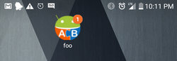
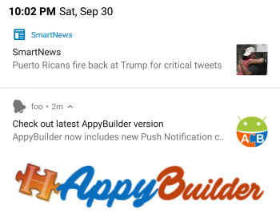
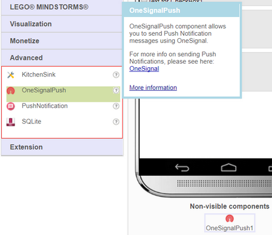
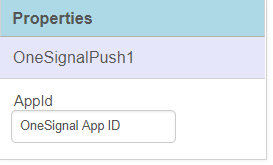
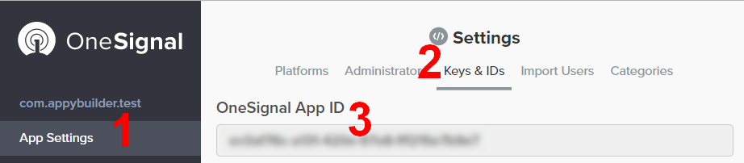
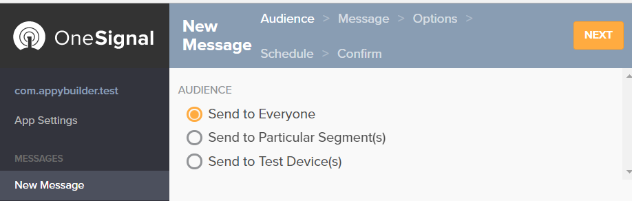
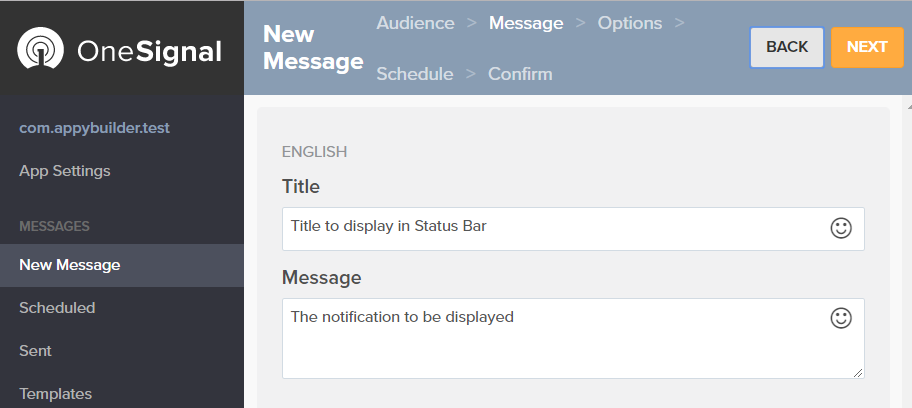
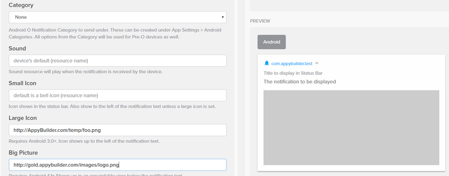
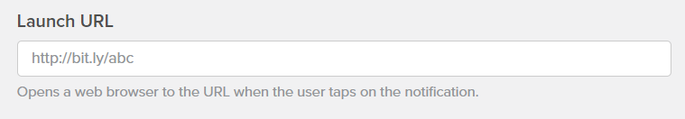

# OneSignalPush

A push notification is a message that pops up on a mobile device. App publishers can send them at any time; users don't have to be in the app or using their devices to receive them. They can do a lot of things; for example, they can show the latest news scores, get a user to take an action, such as downloading an app, or let a user know about an event. Push notifications look like SMS text messages and mobile alerts, but they only reach users who have installed your app.

[**AppyBuilder**](http://AppyBuilder.com) ****now includes a non-visible component called **OneSignalPush** that can be used in the app for receiving push messages. Once setup up, you can easily push messages to anyone who has installed your app. Users will receive the notification, even if the app is closed. The notification will appear in the device status bar and the app icon will automatically be updated to indicate that it it has received a notification \(_**works only on .apk not during Live Development**_\):

User can swipe down the status bar to view notification detail and can tap it for further action:

## App Setup

To prepare app for push messages, drag OneSignalPush component and drop onto designer as shown below:

This component has only one designer property that requires an App ID. Every app, should have its own unique App ID. The App ID will be used, in dashboard, to send notification to app. For obtaining App ID, please see **AppID Setup** section below.

### App ID Setup

OneSignalPush uses SDK provided by [OneSignal.com](http://onesignal.com). The SDK is integrated into AppyBuilder, making it super-simple for your app to receive push messages.

The app requires a unique App ID. To generate a unique ID, create an account at OneSignal.com, and then follow steps 1-3 in their documentation to generate a unique id: [https://documentation.onesignal.com/docs/generate-a-google-server-api-key](https://documentation.onesignal.com/docs/generate-a-google-server-api-key)

This generated ID should be used in the AppyBuilder OneSignalPush property:

You are now ready to push notifications to your app. This can be done during Live Testing or when you have generated .apk.

### Sending Push Notifications

For sending notifications, you must have completed _**"App ID Setup"**_ section above.

The complete documentation can be found [HERE](https://documentation.onesignal.com/docs/sending-notifications), but here is the quick setup:

* Sign into OneSignal.com to log into dashboard
* From left pane, select App Setting, and then "Keys & IDs". This will show you your App ID which will need to be copied into AppyBuilder OneSignalPush Designer Property

* Next, select "New Message" -&gt; "Send to Everyone" and then select "NEXT"

* Next, enter the title and description that you like to show on user's device and then select NEXT:

* Next, you can enter optional information, such as "Large Icon" and "Big Picture". See 3rd image below to see where these images display on user's device. Also, you'll be able to enter an optional URL using "Launch URL". This URL will be opened IF the user taps on your notification. If URL is NOT entered, then once user taps on notification, your app will automatically open on user's device.

* Select NEXT and you'll be able to send the notification either immediately, or schedule it for sending. 
* Once messages are sent, you'll be able to track and view how many users have responded by viewing your messages:

### **Obtaining your application Keys & IDs**

If you have already created a project and want to retrieve your application-key:

* Open a browser window to http://onesignal.com
* Select your project
* Select Settings
* Select "Keys & IDs
* You will then be presented with 

