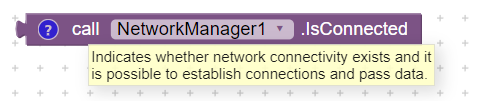
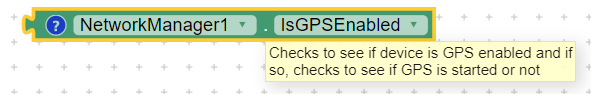
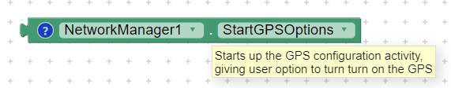
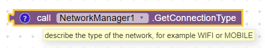
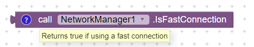

# NetworkManager

This component can be used to provide information about network. The blocks for this component are as follows:

**IsConnected**: Use this block to determine if device has network connectivity. Will return true if connection is through WiFi or Mobile Network

**IsGPSEnabled**: Use this block to determine if GPS is enabled

**StartGPSOptions**: If device isn't connected to GPS, you can start this block to startup the GPS options

**GetConnectionType**: Use this block to determine the connection type; e.g. WiFi or Mobile

**IsFastConnection**: Use this block to determine if device has slow or fast connection. Useful when there is a need to download large files

