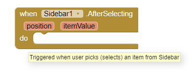

# Sidebar

**Sidebar** panel shows app main navigation menu. When sidebar is not used, it is invisible, and it is visible when the user swipes a finger from the left edge of the screen.

You can setup a headerImage and a list of icons from [here](https://fontawesome.com/cheatsheet)

**Triggering Sidebar.** Triggered when user picks \(selects\) an item from Sidbar

**Creating Sidebar.** You can create a Sidebar menu by following block, there are app's main options in the left edge of screen. The Sidebar is visible if user swipes a finger from left edge of screen.  

HeaderImagePath could be added from asset folder or point to the Internet or even you can leave it empty. Notice that for ListItems , it provides a CSV of items, and for ListIcons, it provides a CSV of icons from [here](https://fontawesome.com/cheatsheet)

**Open Sidebar.** A Sidebar which is already created, can be opened using the following block: 

**Checking Sidebar.** You can check if a Sidebar is opened or not  with the following block:

**Closing Sidebar.** if you want to close a created Sidebar, you can use the below Sidebar , by entering the sidebar name:

**Tutorial.** Please check-out e-Book tutorial [HERE](https://help.appybuilder.com/tutorials/creating-e-book).

