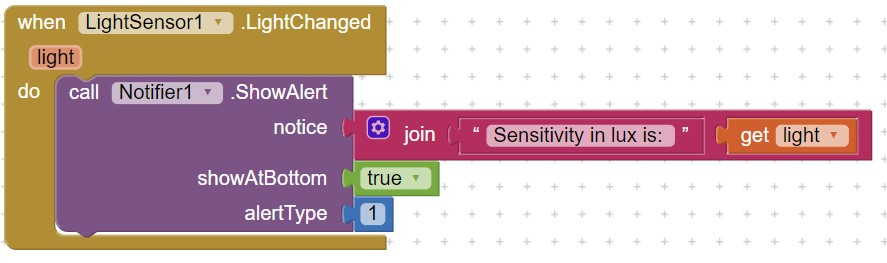

# LightSensor

LightSensor is a non-visible component that measures the ambient light level \(illumination\) in lx.

**Event-handler block.** Event is triggered when a sensor change occurred

**Properties block.**

LightSensor includes following properties-blocks. They allow you to determine if user's device has this type of sensor or enable / disable this sensor.

 

Example

In Screen initialize , you can check if LightSensor is available or not. You can use block LightSensor.LightChanged to determine the sensitivity of light changed in lx unit:

