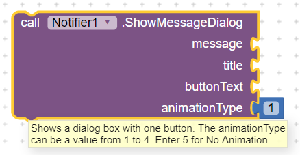
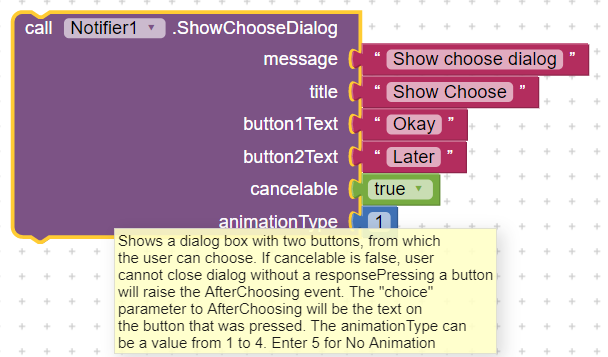
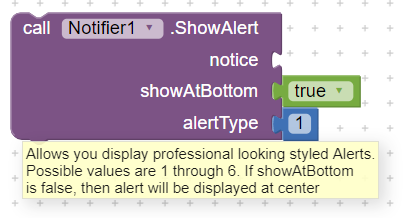
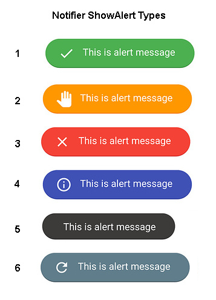
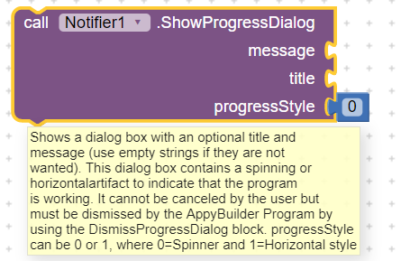

# Notifier

The Notifier component displays alert dialogs, messages, and temporary alerts, and creates Android log entries.

## Methods

### ShowMessageDialog

Displays a message which the user must dismiss by pressing a button. You can specify an animationType \(1 to 5\) where:

* 1 = pop-up from top
* 2 = Slide from top
* 3 = Slide from left
* 4 = Slide from bottom
* 5 = no animation

### ShowChooseDialog

Displays a message two buttons to let the user choose one of two responses, for example, yes or no, after which the AfterChoosing event is raised. You can specify an animationType \(1 to 5\) where:

* 1 = pop-up from top
* 2 = Slide from top
* 3 = Slide from left
* 4 = Slide from bottom
* 5 = no animation

### ShowTextDialog

Lets the user enter text in response to the message, after which the AfterTextInput event is raised. You can specify an animationType \(1 to 5\) where:

* 1 = pop-up from top
* 2 = Slide from top
* 3 = Slide from left
* 4 = Slide from bottom
* 5 = no animation

### ShowAlert

Displays a temporary alert that goes away by itself after a short time. You can specify an alertType of 1 through 6.

### ShowProgressDialog

Displays an alert with a loading spinner that cannot be dismissed by the user. It can only be dismissed by using the DismissProgressDialog block. You can also specify a progressStyle:

* 0 = Spinner style
* 1 = Horizontal style

### DismissProgressDialog

Dismisses the progress dialog displayed by ShowProgressDialog.

### LogError

Logs an error message to the Android log.

### LogInfo

Logs an info message to the Android log.

### LogWarning

Logs a warning message to the Android log.

The messages in the dialogs \(but not the alert\) can be formatted using the following HTML tags: `<b>, <big>, <blockquote>,  , <cite>, <dfn>, 
, <em>, <small>, <strong>, , , <tt>, <u>`  
You can also use the font tag to specify color, for example, ``. Some of the available color names are aqua, black, blue, fuchsia, green, grey, lime, maroon, navy, olive, purple, red, silver, teal, white, and yellow

## Properties

### BackgroundColor

Specifies the background color for alerts \(not dialogs\).

### NotifierLength \(designer only\)

specifies the length of time that the alert is shown -- either "short" or "long".

### TextColor

Specifies the text color for alerts \(not dialogs\).

## Events

### AfterChoosing\(text choice\)

Event after the user has made a selection for ShowChooseDialog.

### AfterTextInput\(text response\)

Event raised after the user has responded to ShowTextDialog.

