# Release Notes

This page lists AppyBuilder Release dates / notes in reverse chronological order. Join Community here: [http://Community.AppyBuilder.com](http://Community.AppyBuilder.com)

 **Sept 18, 2018** -[ Requires Companion Version 5.04](https://play.google.com/store/apps/details?id=com.appybuilder.companiongold) 

* **Enhancement** - Added Screen1 _**MinAPI**_. This is a configurable drop-down property that allows choosing minimum API version from 14 \(Ice Cream Sandwich 4.02\) through 21 \(Lollipop 5.0\); thus allowing installation of apps on lower API devices. Default will be 14
* **Enhancement** - Added Screen1 _**MaxAPI**_. This is a configurable drown-down property that allows choosing maximum API version from 22 \( Lollipop 5.1\) through 26 \( Oreo 8.0\). If you intend to publish your apps to Google Play Store, you should use API 26. However, if you distribute apps internally \(e.g. side-loading\) and do not need to have user grant permissions, then you can use API 22
* **New component** - Added new _**GravitySensor**_ component. This is a Non-visible component that provides a three dimensional vector indicating the direction and magnitude of gravity. Typically, this sensor is used to determine the device relative orientation in space 
*  **New Component** - Added new _**Airtable**_ spreadsheet component \(thanks to [Jerin Jacob](https://community.appybuilder.com/u/jerin_jacob/summary)\). This is non-visible Storage component that provides access to Airtable.com spreadsheets; allowing to use as alternative for storing and manipulating data in cloud. Sign up [HERE](https://airtable.com/invite/r/eHgwOBFW)
* **Feature**: In Blocks editor, added **bitwise** AND, XOR, IOR to _**Math built-in blocks**_
* **Bug fix**:  Fixed a previous regression in _**FusiontablesControl**_ component
* **UI / UX**:  In Designer editor, removed the left component panel swing effect
* **UI / UX:**  In Blocks editor, added context menu items to enable and disable all blocks
* **Companion**: Now can run on devices 4.x and above
* **Companion**: Devices with lower API \(e.g. 4.x\) can also scan QR code download AppyBuilder .apk directly onto device
* **Enhancement:** Added backward compatibility to Android version 4.02

 **August 9, 2018** - Requires [Companion Version 5.03](https://play.google.com/store/apps/details?id=com.appybuilder.companiongold)

* **Bug fixes:** This release is to fix the Permissions issues such as Sharing, Camera
* **Bug fix:** Fixed issues related to AdMob clicks
* **Bug fix:** Fixed issue for Texting messages. If received messages were &gt; 160 characters, only 25 chars were received
* **Bug fix:** Companion was not able to scan QR code to download apk directly to device
* **Bug fix:** fixed variables / procedure color-blocks. Previously there were swapped
* **Companion and building apps \(apk\).** The min sdk is now moved to API 21. We will try lower this API in future releases
* **NOTE:** _**Screen1.RequestAppPermission**_ ****block - Depreciated \(obsolete\). If you are using this block, please remove from your app 

 **July 31st, 2018** Requires [Companion version 5.02](https://play.google.com/store/apps/details?id=com.appybuilder.companiongold)

* **Feature:** Updates for **target SDK 26** 
* **Feature:** Per **European GDPR** requirement, AdMob components now have blocks to get user consent
* **Feature:** For **AdMob** components, now includes ability to set personalized ads using SetConsent block 
* **Feature:** Runtime permissions. Starting Aug 1st, Google requires that app-users have to specifically grant permission for sensitive PERMISSIONS. Sensitive permissions are like Camera, ContactPicker, Texting, PhoneCall, SoundRecorder, Reading / Writing to external storage \(File, Image\). AppyBuilder now checks to see if app uses these permissions \(e.g. Texting\). If yes, then it will automatically pop-up a dialog, asking user to grant permission.  
* **Feature:** Ability to request app-user to grant all permissions use Screen1.RequestAppPermissions block. This will be useful for extension developers. 
* **UI / UX:** Updated user interface - Thanks to [Turbo\_Programming](https://community.appybuilder.com/u/turboprogramming/summary) for his country-flag and UI style contribution

   **July 1st, 2018** - Requires Companion [version 5.01](https://play.google.com/store/apps/details?id=com.appybuilder.companiongold)

* **Feature** - Added new _**Snackbar**_ component. This component is available in Effects category
* **Feature** - Added new _**Sidebar**_ component. This component is available in Effects  category
* **Feature** - Added new _**Decoration**_ component. This component is available in Effects category. It will allow you to change features such as component Margins, Padding
* **Bug fix** - Fixed _**Switch**_ font size issue
* **Feature** - _Switch_ component. Added updated properties / blocks such as Switch track color
* **Feature** - _GoogleSpreadsheet_. Added new Google Spreadsheet component. This component uses [Cloudstich](https://cloudstitch.com) and is available in Storage category
* **Bug fix** - Fixed orientation issue with _FloatingButtonAction_. Thanks to Ken Nichols for his contribution and effort to fix the orientation issue
* **Feature** - Updated _BarcodeScanner_ to include ability to scan a variety of barcodes \(e.g. UPC\_A, UPC\_E, EAN\_13, EAN\_8, RSS\_14, RSS\_EXPANDED, DATA\_MATRIX\). For detail barcode types, please visit page [HERE](https://www.scandit.com/types-barcodes-choosing-right-barcode/). Thanks to Ken Nichols for his contribution to add this feature
* **Feature** - Added DrawShape & DrawArc into _Canvas_ component. Thanks to [ColinTree](https://github.com/ColinTree) for his contribution and efforts 
* **Feature** - _Copy Scree_n. You now have ability to create a copy of any screen. Thanks to Punya for their contribution 
* **Feature** - _Export Screen_. You now have ability to export a specific Screen so that it can be imported into another project. This option is available from 'Projects' menu. Thanks to Punya for their contribution.
* **Feature** - _Import Screen_. You now have ability to import a screen that was exported using "Export Screen\) Screen so that it can be imported into another project. This option is available from 'Projects' menu
* **UI / UX -** Updated user interface
* **UI / UX -** Updated AppyBuilder.com website

 _**March 20, 2018**_  - Requires [**Companion v4.07**](https://play.google.com/store/apps/details?id=com.appybuilder.companiongold)

* **Bug fix** - **Spacer** - Updated component to remove background color. Color is light gray
* **Bug fix** - **ObfuscatedText** - was causing build issue.
* **Feature** - **Spinner**: Added selection index to list of arguments in the **AfterSelection** block
* **Enhancement** - Notifier.**ShowChooseDialog**. Added a block called **TitleImage** that can point to an asset image \(size of up to 150x150\). If used, then **ShowChooseDialog** will display the image next to tile. If image is invalid \(or blank\), then no image
* **Enhancement** - Notifier.**ShowMessageDialog**. Added a block called TitleImage that can point to an asset image \(size of up to 150x150\). If used, then ShowMessageDialog will display the image next to tile. If image is invalid \(or blank\), then no image
* **Enhancement** - Notifier - **ShowProgressDialog** - Updated for Material Design look & feel
* **Enhancement** - Notifier - Now includes a socket for progressStyle; 0=Spinner style \(default\), 1=Horizontal bar
* **Enhancement** - Notifier - **ShowTextDialog** - Updated for Material Design look & feel

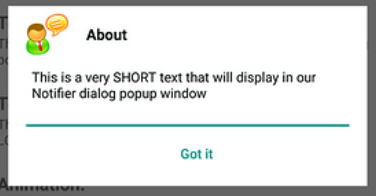

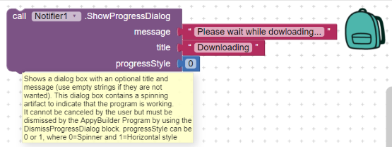

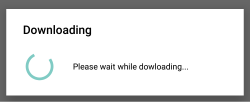

_**March 07, 2018**_  - Requires [**Companion v4.06**](https://play.google.com/store/apps/details?id=com.appybuilder.companiongold)

* Release fixes the the bugs we have been experiencing with below release v4.05 below

 March 05, 2018 - Requires [**Companion v4.05**](https://play.google.com/store/apps/details?id=com.appybuilder.companiongold)

* **Feature**: Added **Spacer** Visible component. Can be used to add Space \(filler / gap\) between components
* Feature: Added Break 

  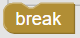

   block. This block can be used to break out of a loop. Available in the Control-drawer of Blocks-Editor 

  \(_Thanks Professor Hal Abelson_\)

* **Feature**: Designer drag and drop - useful when using mobile
* **Feature**: **Web** - Added _UriDecode_ block 
* **Enhancement**: **Notifier** - Updated so that title background to be white - applies to _ShowChooseDialog_ and _ShowMessageDialog_
* **Bug fix**: **Companion** - Updates so that companion would run on Android 4.x
* **Feature**: **Button** - Added _PerformClick_ to dynamically simulate clicking the Button
* **Feature**: **Image** - Added _ImageEffect_ block. Allows for _applying_ effects such as _invert, binary, blue, brown, bw, green, pink, red, sepia_
* **Feature**: **Image** - Added _ApplyShape_ block. Allows for applying shapes such as _circle, octagon, star, triangle_
* **Feature: Screen**

  : Added block: SetTitleBarCustomFont for changing titlebar font 

  

* **Bug fix**: Fixed the broken _**Donate**_ link at top of AppyBuilder page
* **Updated** Terms of Service [HERE](https://help.appybuilder.com/terms-of-service.html)

 Feb 14, 2018 - Requires [**Companion v4.04**](https://play.google.com/store/apps/details?id=com.appybuilder.companiongold)

* **Feature:** _**Toggler**_ Component, added _**TextColor**_ and _**FontSize**_
* **Feature:** _**Web**_ component: Added _**UriDecode**_ block 
* **Feature:**Added _**WallpaperManager**_ component \(Media\) allowing to:
  * SetWallpaper - triggers _**AfterAction**_
    * From assets - use //YourImage.png,
    * From SD card - e.g. /SDfolder/YourImage.png
    * From Internet - user [http://example.com/some\_image.png](http://example.com/some_image.png)
    * From ImagePicker - use ImagePicker.Selection
  * GetWallpaper - triggers _**AfterAction**_. You can use _**AfterAction**_ message parameter to get current path to wallpaper and set into Canvas or Image
* **Feature:** _**Canvas**_: New properties / blocks for _**FontSize**_, _**FontBold**_, _**FontItalic**_, _**FontTypeface**_, _**FontTypefaceCustom**_.
  * These can be used for drawing text on Canvas
* **Enhancement:** _**Map**_: Use GeometryUtil for interpreting Map BoundingBox
* **Bug fix:** Updated _**Notifier**_ so that calls for oneButtonAlert \(e.g. from FirebaseDB\), is now executed using the new style
* **Bug fix:** _**LinedTextEdit**_: Fixed underline issue \(sorry, custom font still does not align properly\)
* **Bug fix:** Previously building apps with FirebaseDB and Texting was caused build issue

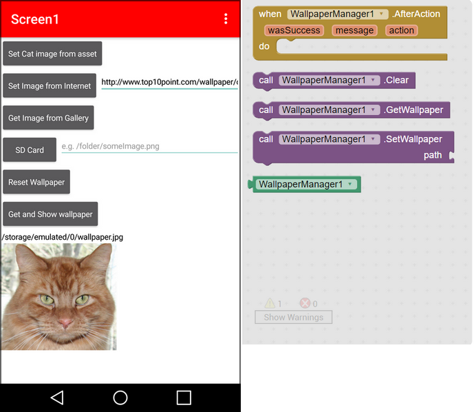

 Feb 02, 2018 Requires [**Companion v4.03**](https://play.google.com/store/apps/details?id=com.appybuilder.companiongold)

This release is to address updates for **Notifier** components. In addition, the Notifier **ShowChooseDialog** and **ShowMessageDialog** blocks can take _**animationTypes**_ of 1 to 4 for four different types of animation \(see below\). Any number greater than 4 means No-Animation:

1. Animate from Top \(demo here: [http://AppyBuilder.com/tutorials/Notifier.gif](http://AppyBuilder.com/tutorials/Notifier.gif)\)
2. Animate from Left \(_great for display Help screens_\)
3. Animate from Right \(_great for display Help screens_\)
4. Animate from Bottom

**The Notifier now:**

* Resizes \(shrink / grow\) automatically based on amount of text 
* Resize automatically based on screen-orientation
* Creates automatic vertical scrolling

 Jan 31, 2018 Requires [**Companion v4.02**](https://play.google.com/store/apps/details?id=com.appybuilder.companiongold)

Updates to **Notifier component**. It now includes updated design and features:

* Ability to include html tags
* Ability to include hyperlinks
* Ability to contain large amount of text with scrolling feature
* Animation from top, side, bottom \(animationStyle 1 to 3\)

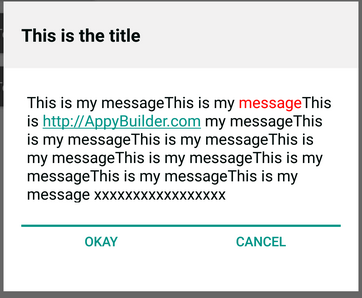

 Jan 28, 2018 - Requires [**Companion v4.01**](https://play.google.com/store/apps/details?id=com.appybuilder.companiongold)

* **Feature:** Notifier - Updated ShowAlert to use fancy material design interface with images

   \(ref 24 [HERE](https://github.com/AppyBuilder/AppyBuilder/issues/24)\). 

  * Block also includes slot for showAtBottom. If true, displays at bottom or at center
  * Block also includes alertType \(1 through 6\) for different alert types

* **Feature:** Notifier - Updated ShowChooseDialog to use fancy material design interface. 
  * Block also includes a slot for animationType \(1 through 3\) that allows you to animate the pop-up from Top, Side or Bottom
* **Feature:** Notifier - Updated ShowMessageDialog to use fancy material design interface. 
  * Block also includes a slot for animationType \(1 through 3\) that allows you to animate the pop-up from Top, Side or Bottom
* **Feature:** Now includes block and designer property for adding TitleColor \(ref 22 [HERE](https://github.com/AppyBuilder/AppyBuilder/issues/22)\) \(Sync with MIT AI\)
* **Bug Fix:** Map FeatureCollection icon was not displaying during drag
* **Feature:** ListViewCuston - Now includes ability to load images from SD Card \(ref 18 [HERE](https://github.com/AppyBuilder/AppyBuilder/issues/18)\)
* **Feature:** WebViewer Added designer and block for opening a WebViewer in external browser \(ref 10 [HERE](https://github.com/AppyBuilder/AppyBuilder/issues/10)\)
* **Feature:** Added color palette wheel to designer color property

   \(ref 25 [HERE](https://github.com/AppyBuilder/AppyBuilder/issues/25)\)

* **Feature:** Accelerometer: Implements a workaround for an Android issue that would cause the Accelerometer to switch X and Y directions on some landscape mode devices \(sync with MIT AI\)
* **Feature:** Blocks editor Text drawer: Added an “is-text?” block to test whether a value is a string \(ref 26 [HERE](https://github.com/AppyBuilder/AppyBuilder/issues/26)\)

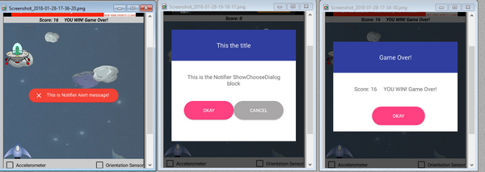

 Jan 16, 2018 - Requires [**Companion v3.26**](https://play.google.com/store/apps/details?id=com.appybuilder.companiongold)

* **CloudDB** Component: New. EXPERIMENTAL -  Integrated CloudDB, allowing you to store / retrieve data from cloud server
* **Slider**: Fixed bug. When ThumbEnabled was set to false, Slider Thumb was disappearing 
* **LinedTextBox:** Moved from Experimental to User Interface category
* **UI/UX:** Logo update - \(\_Thanks to Peter Mathijssen for his work\)
* **Extension:** Bug fix. UsesPermissions annotation with empty string was resulting in invalid manifest
* **Label** - feature: Added ReadMore property / block. If set TRUE, it will make automatically make the Label expandable and collapsable \(_**Thanks to Andres Cotes for his input**_\)
* 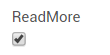

  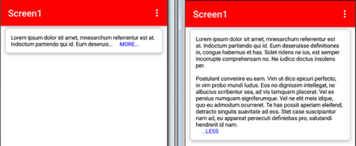

**AppyBuilder needs your support:**

[http://AppyBuilder.com/appybuildersupport.html](http://appybuilder.com/appybuildersupport.html)

 Dec 31, 2017 

[**Companion v3.25**](https://play.google.com/store/apps/details?id=com.appybuilder.companiongold)

**Map Component**: New Integrated MIT latest Openstreet Map component. For more information, see [HERE](http://gold.appybuilder.com/reference/components/maps.html#Map).

* * Simple Map .aia that was developed by Evan from MIT can be found [HERE](http://AppyBuilder.com/tutorials/openstreet/MapsSimple.aia) \(NOTE: GPS location services needs to be turned on

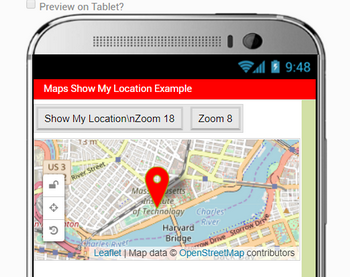

* **MemoryInfo**: Non-visible sensor component to get information about device memory and SD Card

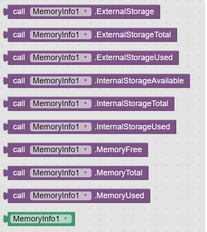

 Dec 11, 2017 

[**Companion v3.24**](https://play.google.com/store/apps/details?id=com.appybuilder.companiongold)

 - 

**AppyBuilder needs your support:**

[http://AppyBuilder.com/appybuildersupport.html](http://appybuilder.com/appybuildersupport.html)

* **HorizontalArrangement:** Updated _**IsCard**_ \[1\]so that it now setups margins all around the border 
* **VerticalArrangement:** Updated _**IsCard**_ \[1\]so that it now setups margins all around the border
* **HorizonalArrangement:** For above, updated Card border background to match the Material Card color
* **VerticalArrangement:** For above, updated Card border background to match the Material Card color
* **Feature:** 

  Arrangements now include UseRoundCorners block. If set to false, the Material Design card will use Rectangle corners, else Round Corners: 

  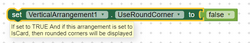

* **FTPManager:**

   Added 

  _**DeleteFolder**_

   block.

   _**Can delete non-empty remote or local folders**_

  . For remote, use  /public

  \_

  html/folder1/folder2/... and for local use /folder1/folder2/... 

  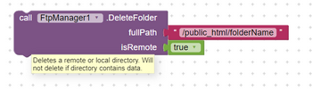

* **UX:** When deleting component, now displays GWT pop-up window
* **Feature:** Added _**Click**_ event-block to all layout arrangements
* **Feature:** Added _**LongClick**_ event-block to all layout arrangements
* Feature: Added StatusBarColor block 

  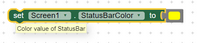

   to Screen. NOTE: Designer won't show color-change.

* **Bug fix:** Updated ListView _**TextSize**_ so that it now can dynamically change text size
* **Bug fix:** Updated ListViewCustom _**TextSize**_ so that it now can dynamically change text size
* **Memory issues:** Performs memory management for loading images and reduces the Out Of Memory issues

**\[1\]**

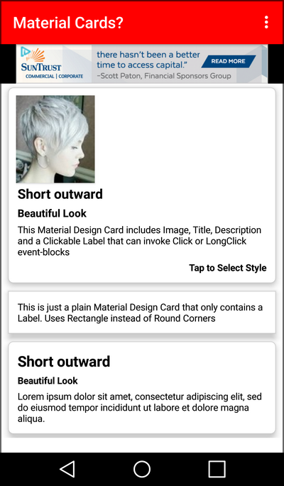

 Nov 27, 2017 

[**Companion v3.23**](https://play.google.com/store/apps/details?id=com.appybuilder.companiongold)

 - 

**AppyBuilder needs your support:**

[http://AppyBuilder.com/appybuildersupport.html](http://appybuilder.com/appybuildersupport.html)

* **Screen:** Added padding to Screen for top, left, bottom, right. Padding can be specified as single number \(e.g. 5\), or 4 numbers \(e.g. 6,7,8,9 for top, left, bottom, right\)
* **Layout Arrangements:** Material Card representation. New property / block \(IsCard\) in Horizontal / Vertical Arrangement. If set to true, arrangement will be converted to Material Card
* **OneSignalPush**: Added blocks for SubscriptionEnabled, VibrateEnabled, SoundEnabled
* Fix messages in some non-English translations \(e.g. Chinese\)
* Display an extension’s version in the help widget
* Perofmance improvement: Prevent error checking on block during drag
* **GalleryViewer**: added Thumbnail width, height in designer with default values
* Make TitleVisible property to toggle title bar's visibility \(Credits to Ben - @moliata on GitHub\)
* **NetworkManager**: New component to get network information, such as below. See doc [HERE](https://help.appybuilder.com/components/networkmanager.html) for details
  * if connected through WiFi, mobile, ...
  * If GPS is on
  * Start GPS options
  * Connection speed; slow, medium, fast

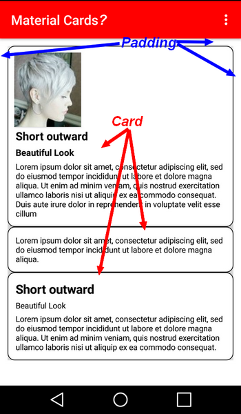

 Oct 28, 2017 

[**Companion v3.22**](https://play.google.com/store/apps/details?id=com.appybuilder.companiongold)

 - AppyBuilder Gold Support / Contribution? 

[**http://PayPal.me/AppyBuilder**](https://www.gitbook.com/book/appybuilder/reference/edit#)

 :o

\)

* Browser bug fixes
* Chrome browser performance update
* Now **FREE** to everyone - no membership required. Just log into [http://Gold.AppyBuilder.com](http://Gold.AppyBuilder.com)
* For forum community please sign into here: [http://Community.AppyBuilder.com](http://Community.AppyBuilder.com)

 Oct. 11, 2017 

[**Companion v3.21**](https://play.google.com/store/apps/details?id=com.appybuilder.companiongold)

 - AppyBuilder Gold -

* Bugfix - **Chrome** latest update \(61\) introduced issue with drop-down position of pop-up menus. This was observed when in Design Editor. Issue resolved
* Feature - **KitchenSink**: Now includes block _**IsKeyboardOpen**_

  \*\*

* Feature - **VideoPlayer**: Added **ControlsEnabled** _peroperty / block_. Allows you to show/hide the controls. By default, its set to enabled
* Feature - **UI** - Added ability to preview media - _**\(Thanks to Aaron Suarez for his contribution**_ [_**HERE**_](https://github.com/mit-cml/appinventor-sources/pull/764)_**\)**_
* Feature - **UI**: Added ability to drag & drop media files for upload into assets _**\(Thanks to Aaron Suarez for his contribution**_ [_**HERE**_](https://github.com/mit-cml/appinventor-sources/pull/763)_**\)**_
* Feature - **Switch** component - Click event: Now includes 'isChecked' paramter that indicates if Switch is Checked or Unchecked
* Feature - **Checkbox** component - Changed event: Now includes '_**isChecked**_' parameter that indicates if Switch is Checked or Unchecked
* Bugfix - Fixed scrolling issue, in both Designer and Blocks-editor:  [http://community.appybuilder.com/t/please-fix-that-scroll-does-not-go-back-to-top/1246/3](http://community.appybuilder.com/t/please-fix-that-scroll-does-not-go-back-to-top/1246/3)
* Feature - Added **EXPERIMENTAL LinedTextBox** component. This is same as TextBox component, however, it includes notepad like lines and is always multiline
* Bugfix - **OneSignalPush** - some devices were experiencing issues at certain times when push message was received. Issue is now fixed

 Sept. 28, 2017 

[**Companion v3.19**](https://play.google.com/store/apps/details?id=com.appybuilder.companiongold)

 - AppyBuilder Gold

* Feature - **Label**: now has _Click_ events can be used to simulate tabs
* Feature - **Label**: now has _LongClick_ events
* Feature - **ListViewCustom**: now can accept SIMPLE html text 
* Feature - New **OneSignalPush** notification component \(Advanced category\) -- See component tutorial [HERE](https://help.appybuilder.com/components/onesignalpush.html)
* Feature - **Label**: _Designer_ now provides draggable text-entry for entering text. This will be useful when entering long text in designer
* Feature - **TextBox**: _Designer_ now provides draggable text-entry for entering text. This will be useful when entering long text in designer
* Feature - **CheckBox**: Added _CheckboxColor_ property & block \(default Dark Gray\)
* Enhancement - **Spinner**: Made spacing between drop-down items wider \(when ShowRadioButton is false\)
* Feature - Added 

  **Windows USB Live Testing**

   ability. Download the installer zip file from 

  [**HERE**](http://AppyBuilder.com/companion/AppyBuilderStarterSetup.zip)

   and unzip and run the .msi instller app, which will install AppyBuilder-installer-app into "

  **C:**

  **\Program Files** 

  **\(**

  **x86**

  **\)**

  **\AppyBuilder Starter**

  " folder. It will also create a shortcut on your Desktop: 

  

   Follow setup direction 

  [**HERE**](https://help.appybuilder.com/live-testing.html)

* BugFix - **WebViewer** _geolocation_ was not working properly
* BugFix: **ListViewCustom** _AfterDeleting_ was returning a zero-based position of deleted-item. Its been updated so that it is now starts from 1. See [**HERE**](http://community.appybuilder.com/t/custom-listview/1402/20) for details
* Documentation: **GalleryViewer** _AfterPicking_ block. Fixed block tooltip
* BugFix: Fixes a bug where the block position in older projects was sometimes forgotten. See [**HERE**](https://github.com/mit-cml/appinventor-sources/pull/931) for details

 Aug 29, 2017 - 

[**Companion v3.18**](https://play.google.com/store/apps/details?id=com.appybuilder.companiongold)

 - AppyBuilder Gold

* Bug fix - Camera component update. Flash was not working on some devices. Now fixed
* Bug fix - ListViewCustom - text now shows left-aliged instead of centered
* Bug fix - ListViewCustom - Now can change FontSize
* Feature - ListViewCustom - New block for changing image size
* Feature - Spinner - now you can set background color
* Feature - Spinner - now you ShowRadioButtons for it
* Feature - UI - Minor UI/UX updates  
* Feature - New Switch component
* Feature - New RatingBar component
* Feature - New 3D shadow effect BLOCK \(SetShadow\) for Label
* Feature - New 3D shadow effect BLOCK \(SetShadow\) for TexBox 
* Feature - New 3D shadow effect BLOCK \(SetShadow\) for CheckBox 
* Feature - New 3D shadow effect BLOCK \(SetShadow\) for Button 
* Feature - New 3D shadow effect BLOCK \(SetShadow\) for ListPicker 

 Aug 29, 2017 - 

[**Companion v3.17**](https://play.google.com/store/apps/details?id=com.appybuilder.companiongold)

 - AppyBuilder Gold - 

**Same as before, No need to re-install**

* Just a non-component release that included enhancement to Design Editor. It now includes Android phone background frame for the phone viewer 

 Aug 21, 2017 -  

[Companion v3.17](https://play.google.com/store/apps/details?id=com.appybuilder.companiongold)

 - AppyBuilder Gold

* New component - **Added AdMob Rewards Video** - This component can be found under Monetize category
* New Component - **Millenium Media Interstitial Ad** - This component can be found under Montetize category

 July 26, 2017 - 

[Companion v3.16](https://play.google.com/store/apps/details?id=com.appybuilder.companiongold)

 - AppyBuilder Gold

* Bug fix - Creating new projects or even opening old projects, could’ve loaded some default extensions. This issue is now resolved.

 July 24, 2017 - 

[Companion v3.15](https://play.google.com/store/apps/details?id=com.appybuilder.companiongold)

 - AppyBuilder Gold

* Sound component - Added PlayRate
* ListView component - AfterDeleting block now includes position \(of the deleted item - index\)
* Notifier component  - Now includes Linkify for enabling the hyperlinks
* New ListViewCustom component -. Same as ListView, but now can include image and list item
* New ListPickerCustom component - Same as ListPicker, but now can include image and list item

 June 29, 2017 - 

[Companion v3.14](https://github.com/AppyBuilder/AppyBuilderDocs/tree/62b594f1af7854b6114eee4ff7e4750c51fd73ef/%20https:/play.google.com/store/apps/details?id=com.appybuilder.companiongold)

 - AppyBuilder Gold

* Bug fix: Fixed crash for GoogleMap 
* Fixed issue with companion crashing on some devices

  June 26, 2017 - 

[Companion v3.13](https://github.com/AppyBuilder/AppyBuilderDocs/tree/62b594f1af7854b6114eee4ff7e4750c51fd73ef/%20https:/play.google.com/store/apps/details?id=com.appybuilder.companiongold)

 - AppyBuilder Gold

Added ability to include PackageName as a Screen1 property. Can be used even for apps with multiple screens

**Includes latest MIT AI updates below:**

_MIT AI Changes between nb155 and nb156 \(May 25, 2017\)_

_This is a non-component release, however it is a significant release because of a major upgrade to the Blocks Editor._

1. _Added the ability to zoom the workspace in/out. Zooming gestures include:_
2. 1. _Click the +/- buttons in the lower left corner above the trashcan._
   2. _Ctrl+Mouse wheel on a mouse._
   3. _Multi-touch trackpad users with Chrome, zooming can also be done with the pinch/expand gesture._
3. _Added the ability to pan the workspace. Panning gestures include:_
4. 1. _Mouse wheel up/down will pan the view vertical._
   2. _Wheels with 2-dimensional scrolling can also pan left/right._
   3. _Multi-touch trackpad users can pan in two dimensions using two-finger scrolling._
5. _Added Reset to center button will set the zoom back to 1:1 and move to the center of the blocks workspace._
6. _Added workspace grid. Right-clicking \(Ctrl+Click on Mac\) on the workspace brings up a context menu with "Enable Workspace Grid" option. This option is a user setting and will persist across workspaces and across App Inventor sessions._
7. _Added workspace snapping. If the grid is enabled, another menu option "Enable Snap to Grid" will be available. Enabling this option will make the top-left corner of blocks snap to the nearest grid point. This option is a user setting and will persist across workspaces and across App Inventor sessions._

 April 07, 2017 - 

[Companion v3.08](https://github.com/AppyBuilder/AppyBuilderDocs/tree/62b594f1af7854b6114eee4ff7e4750c51fd73ef/%20https:/play.google.com/store/apps/details?id=com.appybuilder.companiongold)

 - AppyBuilder Gold

* Sync with MIT AI nb154a and nb155
* Make the Backpack persistent – If you leave AppyBuilder with blocks left in your backpack, they will be there the next time you login
* Updates to better support newer versions of Android
* Webviewer - Added new blockLoadHtmlblockwhich will allow you to useTextblock to type in any valid HTML string
* Webviewer now includes ability to upload files from local device
* Webviewer now includes ability to take picture for directly uploading to server. From Designer, just set AllowCamera to true \(NOTE: You will need to drag-n-drop a Camera component for this to work\)
* PasswordTextBox - Fixed Bug

