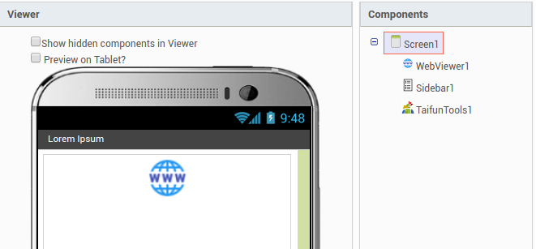
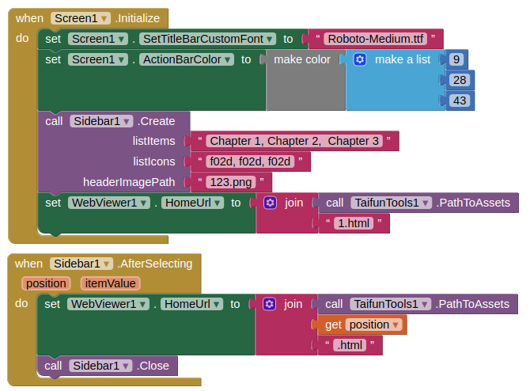
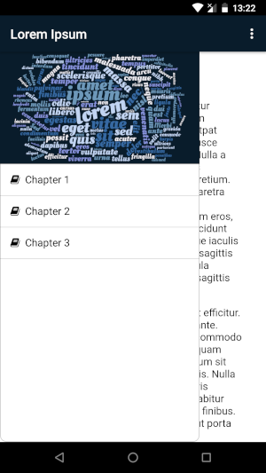

# How to make an e-book

If you want to make an e-book you just need a few components, see the image below.

You can get the TaifunTools extension here: 

And the following blocks. No fancy formula, just straight forward. 

And the result will be

The html-files use a small css file for formatting the text. But you can play with that.

You can use the cheatsheet here for the icons:
https://fontawesome.com/cheatsheet

**A little tip:**
If you use an arrangement or use the webviewer at 100% or fill parent the sidebar will not show. There has to be some background available. So i set the webviewer at 95% width to make it work.

In the aia file there is a fontfile included, 3 html files, a css file and the TaifunTools extension.

